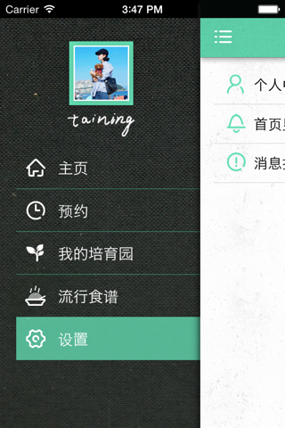
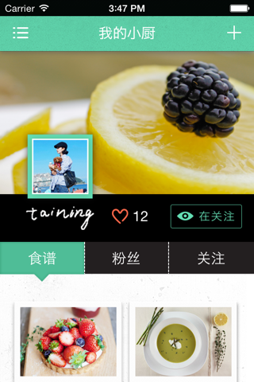
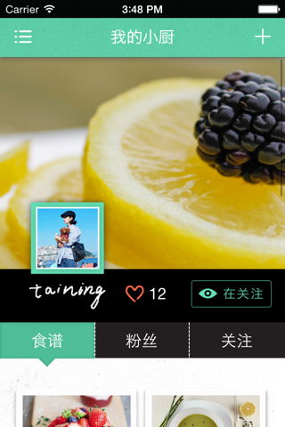
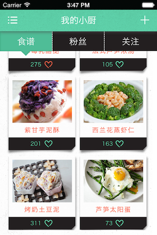
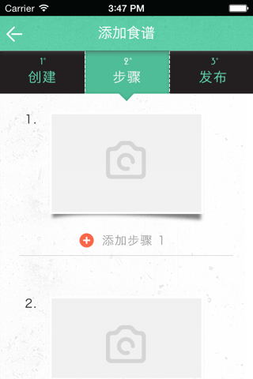

理想培育园
=========

Taining 的 毕设项目，重在视觉和交互实现  

##What i got：  
##1、框架：ios side menu 框架 SWRevealViewController  

##2、webview 中js 与 原生obj-c 的互相调用  
   参考代码部分： 我的培育园，webview中点击，原生navigationController 导航  
##3、类似 twitter 的 scroll view 下拉放大效果；scroll view 想上滚动，菜单元素在顶部停靠  
   参考代码部分：我的小厨页面
   
####顶部图片   
  
####顶部图片放大
  
####菜单顶部停靠

##4、滚动 tab 页面  
   参考代码部分：我的小厨页面、添加食谱
   

